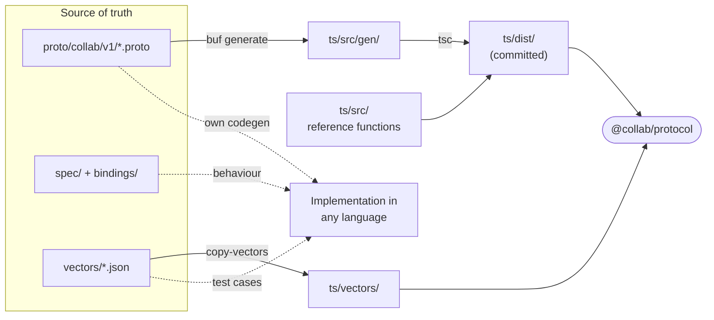
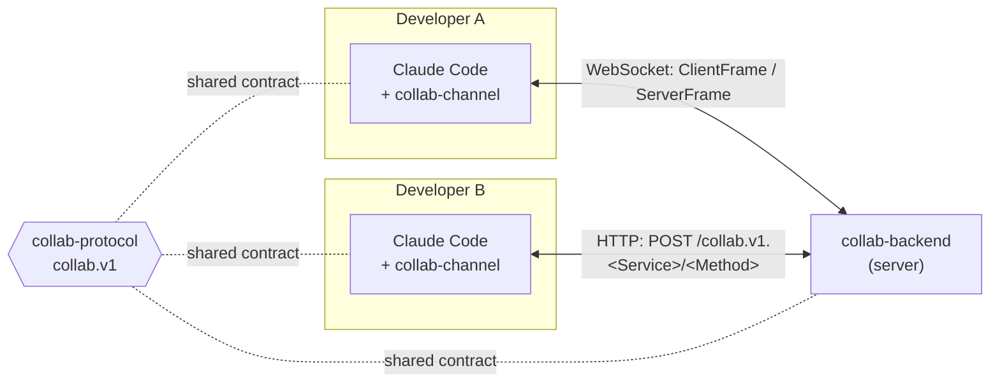
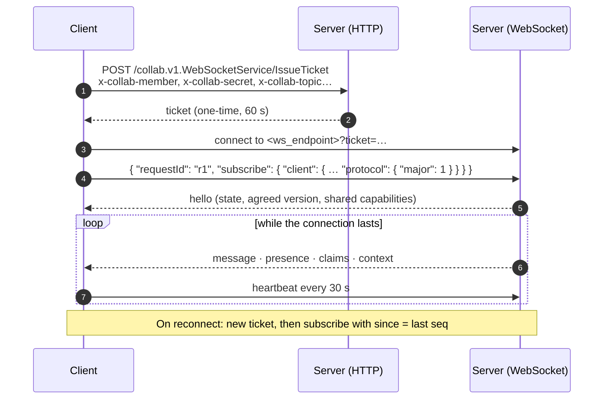

<div align="center">

# collab-protocol

**The Cognikas Collab channel contract (`collab.v1`): what client and server say to each other, and how each one behaves.**

**English** · [Español](README.md)

[](LICENSE)
[](https://github.com/cognikas/collab-protocol/tags)
[](proto/collab/v1/)
[](https://buf.build)
[](ts/)
[](spec/versionado.md)

</div>

---

`collab-protocol` defines how coding-agent sessions (for example, several Claude Code sessions run
by different developers) communicate through a shared channel: messages, presence, file claims,
shared context and task lists.

It is **transport-independent**. The same schema travels over WebSocket and HTTP in 1.0, and could
travel over gRPC later without a redesign. Anyone can write a client or a server in another
language: the schema says **what** is sent, the specification says **how each side behaves**, and
the conformance vectors check it.

> The specification (`spec/`, `bindings/`) is written in Spanish, the working language of the
> project. Code comments, including the `.proto` comments, are in English.

## Contents

- [What's in this repo](#whats-in-this-repo)
- [How it fits together](#how-it-fits-together)
- [Concepts](#concepts)
- [The `collab.v1` schema](#the-collabv1-schema)
- [Transports](#transports)
- [Conformance vectors](#conformance-vectors)
- [Versioning and compatibility](#versioning-and-compatibility)
- [Using it from another repo](#using-it-from-another-repo)
- [TypeScript package `@collab/protocol`](#typescript-package-collabprotocol)
- [Changing the protocol](#changing-the-protocol)
- [Publishing a release](#publishing-a-release)
- [Implementations](#implementations)
- [Authors](#authors)
- [License](#license)

## What's in this repo

| Path | What it is |
|---|---|
| [`proto/collab/v1/`](proto/collab/v1/) | Protobuf **schema**, managed with [Buf](https://buf.build). The source of truth for everything on the wire |
| [`spec/`](spec/README.md) | **Specification**: behaviour [rules](spec/reglas.md) and [versioning](spec/versionado.md) |
| [`bindings/`](bindings/) | **Transports**: [WebSocket](bindings/websocket.md) and [HTTP](bindings/http.md) |
| [`vectors/`](vectors/) | JSON **conformance vectors** every implementation must pass, in any language |
| [`ts/`](ts/) | **TypeScript package** `@collab/protocol`: generated types, reference functions and limits |
| [`CHANGELOG.md`](CHANGELOG.md) | Changes per release |



Generated code and `ts/dist/` are **committed on purpose**: whoever installs the package needs
neither Buf nor a compiler.

## How it fits together



The plugin and the backend depend on this repo as a **git dependency pinned to a tag**. Neither
redefines the protocol: both import the same types and the same reference functions (for example,
the backend uses `visibleTo()` instead of reimplementing it).

## Concepts

| Concept | What it is |
|---|---|
| **Channel** | A team's space. Members, messages, claims, context and task lists belong to a channel |
| **Member** (`member_id`) | A credential, one per developer installation. Issued by `Join` when an invitation is redeemed |
| **Handle** | How a member is addressed. Derived from the display name (`handleOf`), unique and immutable |
| **Client session** (`client_session_id`) | A running agent session of a member. A member can have several at once |
| **Topic** (`topic`) | A session's topic, e.g. the repo it works in. It decides what that session sees |
| **Task list** | A named checklist inside a topic. Its tasks are taken, progressed and closed |
| **Call context** | Who is calling and from where. Provided by the binding, not by the request |

Every message has a recipient: **there is no broadcast to the whole channel**. Addressing,
visibility, cursors, claims, context, tasks, presence and limits are detailed in
[`spec/reglas.md`](spec/reglas.md).

## The `collab.v1` schema

It is organized in layers ([`spec/README.md`](spec/README.md#capas)):

1. **Model** — `model.proto`, `errors.proto`
2. **Operations** — `channel.proto`, `membership.proto`, `admin.proto`, `server_info.proto`.
   They are Protobuf services even though 1.0 doesn't use gRPC, so gRPC becomes one more binding
   rather than a redesign.
3. **Bindings** — `websocket.proto` and [`bindings/`](bindings/)
4. **Rules and vectors** — the behaviour the schema cannot express

### Services and operations

| Service | Operations | Credential |
|---|---|---|
| `ChannelService` | `Subscribe` (stream), `GetState`, `Send`, `Ack`, `Claim`, `Release`, `PutContext`, `GetContext`, `SetPresence`, `History`, `Heartbeat`, `CreateTaskList`, `AddTasks`, `UpdateTask`, `ListTasks` | member |
| `MembershipService` | `Join` | none: the invitation is the credential |
| `AdminService` | `CreateInvite`, `RevokeMember` | admin key |
| `ServerInfoService` | `GetServerInfo` | none |
| `WebSocketService` | `IssueTicket` | member |

### Model

| Group | Types |
|---|---|
| Messages | `Message`, `MessageType`, `Urgency`, `Recipient`, `Addressee` |
| Typed payloads | `DonePayload`, `ClaimPayload`, `ReleasePayload`, `ContextPayload`, `TaskPayload` |
| Members and presence | `Member`, `MemberSession`, `MemberStatus` |
| Claims and context | `Claim`, `ContextEntry`, `ContextSummary` |
| Tasks | `TaskList`, `Task`, `TaskStatus`, `TaskEvent`, `TaskHolder`, `TaskNote` |
| State and version | `ChannelState`, `ProtocolVersion`, `ClientInfo` |
| Errors | `ErrorCode` (closed enum), `ErrorDetail` |

**Message types** (`MessageType`): clients can only send `NOTE`, `QUESTION` and `DONE`. `CLAIM`,
`RELEASE`, `CONTEXT` and `TASK` are written by the server.

### WebSocket frames

| Frame | Direction | Cases |
|---|---|---|
| `ClientFrame` | client → server | `subscribe`, `send`, `ack`, `claim`, `release`, `put_context`, `get_context`, `set_presence`, `history`, `heartbeat`, `create_task_list`, `add_tasks`, `update_task` |
| `ServerFrame` | server → client | `hello`, `message`, `presence`, `claims`, `context`, `result`, `error` |
| `Result` | server → client | the answer to a `ClientFrame` that carried a `request_id` |

## Transports

| | WebSocket | HTTP |
|---|---|---|
| **Carries** | The `Subscribe` stream and the unary `ChannelService` operations | **All** unary operations of all services |
| **Shape** | One `ClientFrame` / `ServerFrame` per text message, in Protobuf JSON | `POST /<package>.<Service>/<Method>` with Protobuf JSON |
| **Authentication** | One-time ticket from `IssueTicket` in `?ticket=` (60 s) | `x-collab-*` headers |
| **Only here** | `Subscribe` | `GetState`, `ListTasks` and bodies over 128 KB |
| **Details** | [`bindings/websocket.md`](bindings/websocket.md) | [`bindings/http.md`](bindings/http.md) |



An operation over WebSocket:

```json
{ "requestId": "r2", "send": { "text": "listo", "to": { "topic": "collab-global" } } }
{ "result": { "requestId": "r2", "send": { "seq": 53, "delivered": 1 } } }
```

Over HTTP, an error comes back with the status from `httpStatusOf(code)` and an `ErrorDetail`:

```json
{ "code": "ERROR_CODE_NAME_TAKEN", "message": "..." }
```

## Conformance vectors

The vectors **are the contract**. Each file in [`vectors/`](vectors/) lists inputs and the expected
output; an implementation in any language conforms if it passes them all.

| File | What it checks | Reference function |
|---|---|---|
| [`names.json`](vectors/names.json) | Names of topics, handles, context keys and task-list keys | `slug`, `contextKey`, `taskListKey`, `isTopic`, `isClientSessionId` |
| [`sanitize.json`](vectors/sanitize.json) | Cleaning other people's text before displaying it | `cleanLine`, `cleanText` |
| [`visibility.json`](vectors/visibility.json) | Which session can read which message, including reading as the member | `visibleTo` |
| [`negotiation.json`](vectors/negotiation.json) | Version and capability negotiation | `negotiate`, `sharedCapabilities`, `parseVersion` |
| [`frames.json`](vectors/frames.json) | Canonical JSON for each frame, plus unknown fields a reader must ignore | `encode` / `decode` |

For example, a case from `names.json`:

```json
{ "input": "Carlos Echeverria", "output": "carlos-echeverria" }
```

To write your own implementation:

1. Generate the types from `proto/collab/v1/` with your language's Protobuf generator.
2. Implement the rules in [`spec/reglas.md`](spec/reglas.md) and the bindings you need.
3. Run every file in `vectors/` in your test suite and compare against the expected output. The
   tests in [`ts/test/`](ts/test/) are the reference example.

> Changing a vector's expected output changes the protocol's behaviour for **every**
> implementation: it is treated as a protocol change (see [versioning](spec/versionado.md)).

## Versioning and compatibility

There are three different numbers:

| What | Example | Where it lives |
|---|---|---|
| **Protocol** | `1.0` | This repo. The major is the Protobuf package suffix (`collab.v1`) |
| **Release of this repo** | `1.0.0-rc.5` | `package.json`, `ts/package.json` and `PROTOCOL_RELEASE`. Patch and pre-release don't travel on the wire |
| **Implementations** | `collab-channel 1.0.0` | Each repo. They declare which protocol versions they speak |

| Change | Kind |
|---|---|
| New field, operation, event, enum value or error code · raising a limit · new capability | **Minor**, compatible in both directions |
| Removing or renaming something · changing a field type or number · changing a meaning · lowering a limit | **Major**: new package `collab.v2` |

Minor changes work because every reader **ignores fields and enum values it doesn't know**.
`pnpm breaking` (`buf breaking`) compares each change against the latest stable release and fails
if it breaks compatibility.

**Negotiation:** the client declares its `ClientInfo` in `SubscribeRequest` (and over HTTP, the
`x-collab-protocol: <major>.<minor>` header). The server looks for a version with the same major and
agrees on the lower minor of the two. If there is none, it answers `ERROR_CODE_UNSUPPORTED_PROTOCOL`.
A client can ask first with `GetServerInfo`, which needs no credential.

**Capabilities:** optional features go in named modules, each with its own Protobuf package. 1.0
defines none.

Full details in [`spec/versionado.md`](spec/versionado.md).

## Using it from another repo

No package registry: a git dependency pinned to a tag.

```json
"dependencies": {
  "@collab/protocol": "github:cognikas/collab-protocol#v1.0.0-rc.5&path:/ts"
}
```

Since generated code and `ts/dist/` are committed, installing needs neither Buf nor a compiler. The
lockfile pins the exact commit. The repo is public, so it installs over HTTPS with no credentials.

> **Tip:** if your git config forces SSH for GitHub and the machine has no SSH key, pnpm may fail
> to clone. Fix it once with:
>
> ```bash
> git config --global url."https://github.com/".insteadOf "git+ssh://git@github.com/"
> git config --global --add url."https://github.com/".insteadOf "ssh://git@github.com/"
> ```

## TypeScript package `@collab/protocol`

```ts
import { create, SendRequestSchema, slug, visibleTo, negotiate, rpcPath } from '@collab/protocol';
```

| Exports | Examples |
|---|---|
| Generated types and schemas for all of `collab.v1` | `Message`, `SendRequest`, `ClientFrame`, `ErrorCode`… |
| Reference functions | `slug`, `handleOf`, `contextKey`, `taskListKey`, `cleanLine`, `cleanText`, `visibleTo`, `negotiate`, `sharedCapabilities` |
| Protobuf JSON | `encode`, `decode`, `encodeValue`, `decodeValue` |
| HTTP | `rpcPath`, `httpStatusOf`, `HEADER_*` headers |
| Version and limits | `PROTOCOL`, `PROTOCOL_RELEASE`, `HEARTBEAT_SECONDS`, `MAX_MESSAGE_CHARS`, `WS_TICKET_TTL_SECONDS`… |
| Protobuf runtime | `create`, `isMessage`, `clone`, `equals` and `Timestamp` helpers |
| Vectors | `@collab/protocol/vectors/*.json` |

The package re-exports the `@bufbuild/protobuf` runtime so consumers don't depend on it directly
and can't end up on a different version.

## Changing the protocol

Requirements: Node ≥ 20 and pnpm.

```bash
pnpm install
pnpm lint        # buf lint + format
pnpm build       # buf generate → ts/src/gen, and tsc → ts/dist
pnpm typecheck && pnpm test
pnpm breaking    # buf breaking against the latest stable release
```

1. Edit the `.proto` (and the specification, if a behaviour changes).
2. `pnpm build`, and commit the `.proto`, `ts/src/gen/` and `ts/dist/` together. Never edit them by hand.
3. Decide whether it is minor or major per [`spec/versionado.md`](spec/versionado.md);
   `pnpm breaking` must pass for it to be minor.

Changes go through branches merged into `main` by PR.

## Publishing a release

```bash
node scripts/version.mjs 1.0.0   # package.json, ts/package.json and ts/src/version.ts
pnpm build && pnpm test
git commit -am "Release 1.0.0" && git tag v1.0.0 && git push --follow-tags
```

`ts/test/versions.test.ts` fails if the three versions drift. Then, in each implementation, bump the
dependency tag and run `pnpm install`.

## Implementations

| Repo | Role | Access |
|---|---|---|
| [`cognikas/collab-plugin`](https://github.com/cognikas/collab-plugin) | Client: the `collab-channel` Claude Code plugin | Public |
| `cognikas/collab-backend` | Server (AWS: API Gateway, Lambda, DynamoDB) | Private. Access by invitation from the [Cognikas community](https://www.cognikas.com/en/community/?utm_source=github&utm_medium=readme&utm_campaign=collab-protocol) |

The previous protocol, protocol 2 of `collab-channel` 0.6, remains as a historical reference in
`claude-code-collaboration`. It is not compatible with `collab.v1` ([what changed](spec/README.md#qué-cambia-respecto-del-protocolo-2-collab-channel-06)).

## Authors

<table>
  <tr>
    <td align="center">
      <a href="https://github.com/egcarlos">
        <br />
        <b>Carlos Echeverría</b>
      </a><br />
      <sub>@egcarlos</sub>
    </td>
    <td align="center">
      <a href="https://github.com/jesod">
        <br />
        <b>Willy Sotomayor</b>
      </a><br />
      <sub>@jesod</sub>
    </td>
  </tr>
</table>

## License

[Apache License 2.0](LICENSE). See also [`NOTICE`](NOTICE).

---

<div align="center">
  <sub>
    Made by <a href="https://www.cognikas.com/en/?utm_source=github&utm_medium=readme&utm_campaign=collab-protocol"><b>Cognikas</b></a>
    · More open projects in the <a href="https://www.cognikas.com/en/community/?utm_source=github&utm_medium=readme&utm_campaign=collab-protocol">community</a>
  </sub>
</div>
