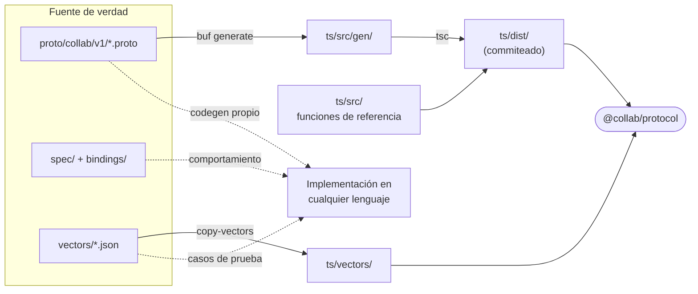
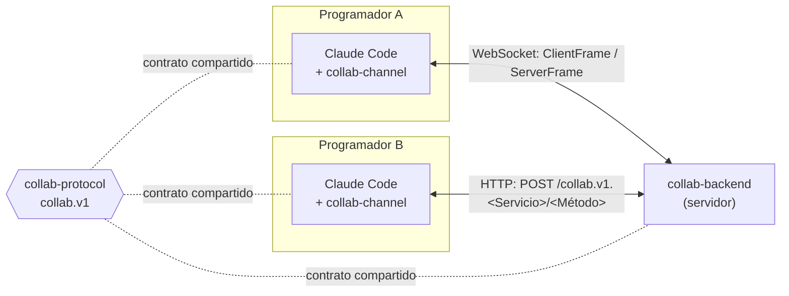
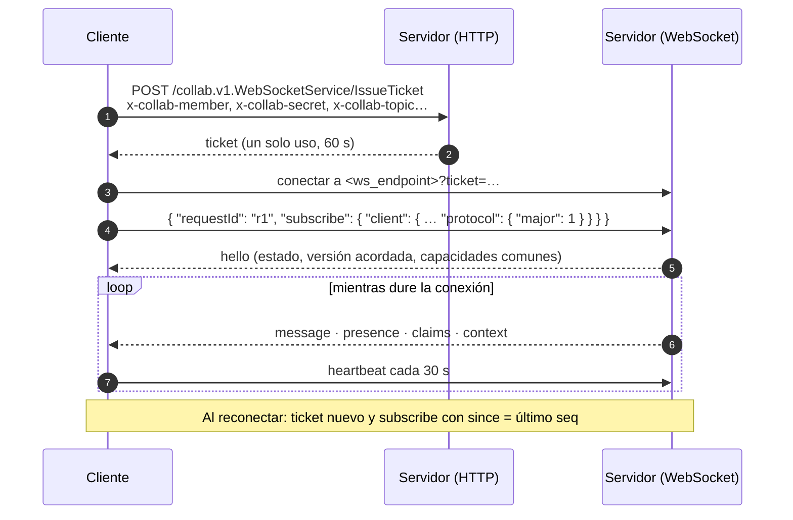

<div align="center">

# collab-protocol

**El contrato del canal de Cognikas Collab (`collab.v1`): qué se dicen cliente y servidor, y cómo se comporta cada uno.**

[English](README.en.md) · **Español**

[](LICENSE)
[](https://github.com/cognikas/collab-protocol/tags)
[](proto/collab/v1/)
[](https://buf.build)
[](ts/)
[](spec/versionado.md)

</div>

---

`collab-protocol` define cómo se comunican las sesiones de agentes de código (por ejemplo, varias
sesiones de Claude Code de distintos programadores) a través de un canal compartido: mensajes,
presencia, reservas de archivos, contexto compartido y listas de tareas.

Es **independiente del transporte**. El mismo esquema viaja por WebSocket y HTTP en 1.0, y podría
viajar por gRPC más adelante sin rediseñarlo. Cualquiera puede escribir un cliente o un servidor en
otro lenguaje: el esquema dice **qué** se envía, la especificación dice **cómo se comporta** cada
parte, y los vectores de conformidad lo comprueban.

## Contenido

- [Qué hay en este repo](#qué-hay-en-este-repo)
- [Cómo encaja](#cómo-encaja)
- [Conceptos](#conceptos)
- [El esquema `collab.v1`](#el-esquema-collabv1)
- [Transportes](#transportes)
- [Vectores de conformidad](#vectores-de-conformidad)
- [Versionado y compatibilidad](#versionado-y-compatibilidad)
- [Usarlo desde otro repo](#usarlo-desde-otro-repo)
- [Paquete TypeScript `@collab/protocol`](#paquete-typescript-collabprotocol)
- [Cambiar el protocolo](#cambiar-el-protocolo)
- [Publicar una release](#publicar-una-release)
- [Implementaciones](#implementaciones)
- [Autores](#autores)
- [Licencia](#licencia)

## Qué hay en este repo

| Ruta | Qué es |
|---|---|
| [`proto/collab/v1/`](proto/collab/v1/) | **Esquema** Protobuf, gestionado con [Buf](https://buf.build). Fuente de verdad de todo lo que viaja por la red |
| [`spec/`](spec/README.md) | **Especificación**: [reglas](spec/reglas.md) de comportamiento y [versionado](spec/versionado.md) |
| [`bindings/`](bindings/) | **Transportes**: [WebSocket](bindings/websocket.md) y [HTTP](bindings/http.md) |
| [`vectors/`](vectors/) | **Vectores de conformidad** en JSON que toda implementación debe pasar, en cualquier lenguaje |
| [`ts/`](ts/) | **Paquete TypeScript** `@collab/protocol`: tipos generados, funciones de referencia y límites |
| [`CHANGELOG.md`](CHANGELOG.md) | Cambios por release |



El código generado y `ts/dist/` están **commiteados a propósito**: quien instala el paquete no
necesita Buf ni compilar.

## Cómo encaja



El plugin y el backend dependen de este repo como **dependencia git fijada a un tag**. Ninguno
redefine el protocolo: los dos importan los mismos tipos y las mismas funciones de referencia (por
ejemplo, el backend usa `visibleTo()` en vez de reimplementarla).

## Conceptos

| Concepto | Qué es |
|---|---|
| **Canal** | El espacio de un equipo. Miembros, mensajes, reservas, contexto y listas de tareas pertenecen a un canal |
| **Miembro** (`member_id`) | Una credencial, una por instalación de cada desarrollador. La emite `Join` al canjear una invitación |
| **Handle** | Cómo se nombra a un miembro al escribirle. Se deriva del nombre visible (`handleOf`), es único y no cambia |
| **Sesión de cliente** (`client_session_id`) | Una sesión de agente en marcha de un miembro. Un miembro puede tener varias a la vez |
| **Tema** (`topic`) | El tema de una sesión, por ejemplo el repo en el que trabaja. Decide qué ve esa sesión |
| **Lista de tareas** | Un checklist con nombre dentro de un tema. Sus tareas se toman, avanzan y se cierran |
| **Contexto de la llamada** | Quién llama y desde dónde. Lo aporta el binding, no la petición |

Todo mensaje tiene destinatario: **no existe el envío a todo el canal**. El detalle de
direccionamiento, visibilidad, cursores, reservas, contexto, tareas, presencia y límites está en
[`spec/reglas.md`](spec/reglas.md).

## El esquema `collab.v1`

Se organiza en capas ([`spec/README.md`](spec/README.md#capas)):

1. **Modelo** — `model.proto`, `errors.proto`
2. **Operaciones** — `channel.proto`, `membership.proto`, `admin.proto`, `server_info.proto`.
   Son servicios Protobuf aunque 1.0 no use gRPC, para que gRPC sea un binding más y no un rediseño.
3. **Bindings** — `websocket.proto` y [`bindings/`](bindings/)
4. **Reglas y vectores** — el comportamiento que el esquema no puede expresar

### Servicios y operaciones

| Servicio | Operaciones | Credencial |
|---|---|---|
| `ChannelService` | `Subscribe` (stream), `GetState`, `Send`, `Ack`, `Claim`, `Release`, `PutContext`, `GetContext`, `SetPresence`, `History`, `Heartbeat`, `CreateTaskList`, `AddTasks`, `UpdateTask`, `ListTasks` | miembro |
| `MembershipService` | `Join` | ninguna: la invitación es la credencial |
| `AdminService` | `CreateInvite`, `RevokeMember` | clave de administración |
| `ServerInfoService` | `GetServerInfo` | ninguna |
| `WebSocketService` | `IssueTicket` | miembro |

### Modelo

| Grupo | Tipos |
|---|---|
| Mensajes | `Message`, `MessageType`, `Urgency`, `Recipient`, `Addressee` |
| Payloads tipados | `DonePayload`, `ClaimPayload`, `ReleasePayload`, `ContextPayload`, `TaskPayload` |
| Miembros y presencia | `Member`, `MemberSession`, `MemberStatus` |
| Reservas y contexto | `Claim`, `ContextEntry`, `ContextSummary` |
| Tareas | `TaskList`, `Task`, `TaskStatus`, `TaskEvent`, `TaskHolder`, `TaskNote` |
| Estado y versión | `ChannelState`, `ProtocolVersion`, `ClientInfo` |
| Errores | `ErrorCode` (enum cerrado), `ErrorDetail` |

**Tipos de mensaje** (`MessageType`): los clientes solo pueden enviar `NOTE`, `QUESTION` y `DONE`.
`CLAIM`, `RELEASE`, `CONTEXT` y `TASK` los escribe el servidor.

### Frames del WebSocket

| Frame | Dirección | Casos |
|---|---|---|
| `ClientFrame` | cliente → servidor | `subscribe`, `send`, `ack`, `claim`, `release`, `put_context`, `get_context`, `set_presence`, `history`, `heartbeat`, `create_task_list`, `add_tasks`, `update_task` |
| `ServerFrame` | servidor → cliente | `hello`, `message`, `presence`, `claims`, `context`, `result`, `error` |
| `Result` | servidor → cliente | la respuesta a un `ClientFrame` que llevaba `request_id` |

## Transportes

| | WebSocket | HTTP |
|---|---|---|
| **Qué lleva** | El stream de `Subscribe` y las operaciones unarias de `ChannelService` | **Todas** las operaciones unarias de todos los servicios |
| **Forma** | Un frame `ClientFrame` / `ServerFrame` por mensaje de texto, en JSON de Protobuf | `POST /<paquete>.<Servicio>/<Método>` con JSON de Protobuf |
| **Autenticación** | Ticket de un solo uso de `IssueTicket` en `?ticket=` (60 s) | Cabeceras `x-collab-*` |
| **Solo aquí** | `Subscribe` | `GetState`, `ListTasks` y cuerpos de más de 128 KB |
| **Detalle** | [`bindings/websocket.md`](bindings/websocket.md) | [`bindings/http.md`](bindings/http.md) |



Un ejemplo de operación por WebSocket:

```json
{ "requestId": "r2", "send": { "text": "listo", "to": { "topic": "collab-global" } } }
{ "result": { "requestId": "r2", "send": { "seq": 53, "delivered": 1 } } }
```

Por HTTP, un error vuelve con el status de `httpStatusOf(code)` y un `ErrorDetail`:

```json
{ "code": "ERROR_CODE_NAME_TAKEN", "message": "..." }
```

## Vectores de conformidad

Los vectores **son el contrato**. Cada archivo de [`vectors/`](vectors/) lista entradas y la salida
esperada; una implementación en cualquier lenguaje es conforme si los pasa todos.

| Archivo | Qué comprueba | Función de referencia |
|---|---|---|
| [`names.json`](vectors/names.json) | Nombres de temas, handles, claves de contexto y de listas de tareas | `slug`, `contextKey`, `taskListKey`, `isTopic`, `isClientSessionId` |
| [`sanitize.json`](vectors/sanitize.json) | Limpieza del texto de otros antes de mostrarlo | `cleanLine`, `cleanText` |
| [`visibility.json`](vectors/visibility.json) | Qué sesión puede leer qué mensaje, también leyendo como miembro | `visibleTo` |
| [`negotiation.json`](vectors/negotiation.json) | Negociación de versión y capacidades | `negotiate`, `sharedCapabilities`, `parseVersion` |
| [`frames.json`](vectors/frames.json) | JSON canónico de cada frame, y campos desconocidos que un lector debe ignorar | `encode` / `decode` |

Por ejemplo, un caso de `names.json`:

```json
{ "input": "Carlos Echeverria", "output": "carlos-echeverria" }
```

Para escribir una implementación propia:

1. Generar los tipos desde `proto/collab/v1/` con el generador de Protobuf de su lenguaje.
2. Implementar las reglas de [`spec/reglas.md`](spec/reglas.md) y los bindings que necesite.
3. Recorrer cada archivo de `vectors/` en su suite de pruebas y comparar con la salida esperada. Los
   tests de [`ts/test/`](ts/test/) son el ejemplo de referencia.

> Cambiar la salida esperada de un vector cambia el comportamiento del protocolo para **todas** las
> implementaciones: se trata como un cambio de protocolo (ver [versionado](spec/versionado.md)).

## Versionado y compatibilidad

Hay tres números distintos:

| Qué | Ejemplo | Dónde vive |
|---|---|---|
| **Protocolo** | `1.0` | Este repo. La mayor es el sufijo del paquete Protobuf (`collab.v1`) |
| **Release de este repo** | `1.0.0-rc.5` | `package.json`, `ts/package.json` y `PROTOCOL_RELEASE`. El parche y la pre-release no viajan por la red |
| **Implementaciones** | `collab-channel 1.0.0` | Cada repo. Declaran qué versiones del protocolo hablan |

| Cambio | Tipo |
|---|---|
| Campo, operación, evento, valor de enum o código de error nuevo · subir un límite · capacidad nueva | **Menor**, compatible en las dos direcciones |
| Quitar o renombrar algo · cambiar un tipo o un número de campo · cambiar un significado · bajar un límite | **Mayor**: paquete nuevo `collab.v2` |

Los cambios menores funcionan porque todo lector **ignora los campos y los valores de enum que no
conoce**. `pnpm breaking` (`buf breaking`) compara cada cambio contra la última release estable y
falla si rompe la compatibilidad.

**Negociación:** el cliente declara su `ClientInfo` en `SubscribeRequest` (y en HTTP, la cabecera
`x-collab-protocol: <mayor>.<menor>`). El servidor busca una versión con la misma mayor y acuerda
la menor más baja de las dos. Si no la encuentra, responde `ERROR_CODE_UNSUPPORTED_PROTOCOL`. Un
cliente puede preguntar antes con `GetServerInfo`, que no necesita credencial.

**Capacidades:** lo opcional va en módulos con nombre, cada uno con su propio paquete Protobuf. 1.0
no define ninguna.

El detalle completo está en [`spec/versionado.md`](spec/versionado.md).

## Usarlo desde otro repo

Sin registro de paquetes: una dependencia git fijada a un tag.

```json
"dependencies": {
  "@collab/protocol": "github:cognikas/collab-protocol#v1.0.0-rc.5&path:/ts"
}
```

Como el código generado y `ts/dist/` están commiteados, quien lo instala no necesita Buf ni
compilar. El lockfile fija el commit exacto. El repo es público, así que se instala por HTTPS sin
credenciales.

> **Consejo:** si su configuración de git fuerza SSH para GitHub y la máquina no tiene clave SSH,
> pnpm puede fallar al clonar. Se resuelve una vez con:
>
> ```bash
> git config --global url."https://github.com/".insteadOf "git+ssh://git@github.com/"
> git config --global --add url."https://github.com/".insteadOf "ssh://git@github.com/"
> ```

## Paquete TypeScript `@collab/protocol`

```ts
import { create, SendRequestSchema, slug, visibleTo, negotiate, rpcPath } from '@collab/protocol';
```

| Qué exporta | Ejemplos |
|---|---|
| Tipos y esquemas generados de todo `collab.v1` | `Message`, `SendRequest`, `ClientFrame`, `ErrorCode`… |
| Funciones de referencia | `slug`, `handleOf`, `contextKey`, `taskListKey`, `cleanLine`, `cleanText`, `visibleTo`, `negotiate`, `sharedCapabilities` |
| JSON de Protobuf | `encode`, `decode`, `encodeValue`, `decodeValue` |
| HTTP | `rpcPath`, `httpStatusOf`, cabeceras `HEADER_*` |
| Versión y límites | `PROTOCOL`, `PROTOCOL_RELEASE`, `HEARTBEAT_SECONDS`, `MAX_MESSAGE_CHARS`, `WS_TICKET_TTL_SECONDS`… |
| Runtime de Protobuf | `create`, `isMessage`, `clone`, `equals` y utilidades de `Timestamp` |
| Vectores | `@collab/protocol/vectors/*.json` |

El paquete reexporta el runtime de `@bufbuild/protobuf` para que los consumidores no dependan de él
directamente y no terminen con otra versión.

## Cambiar el protocolo

Requisitos: Node ≥ 20 y pnpm.

```bash
pnpm install
pnpm lint        # buf lint + formato
pnpm build       # buf generate → ts/src/gen, y tsc → ts/dist
pnpm typecheck && pnpm test
pnpm breaking    # buf breaking contra la última release estable
```

1. Editar el `.proto` (y la especificación, si cambia un comportamiento).
2. `pnpm build`, y commitear el `.proto`, `ts/src/gen/` y `ts/dist/` juntos. Nunca se editan a mano.
3. Decidir si es menor o mayor según [`spec/versionado.md`](spec/versionado.md);
   `pnpm breaking` tiene que pasar para que sea menor.

Los cambios entran por ramas y se integran a `main` con PR. La especificación, los bindings y los
mensajes de commit van en español; los comentarios del código, incluidos los del `.proto`, en inglés.

## Publicar una release

```bash
node scripts/version.mjs 1.0.0   # package.json, ts/package.json y ts/src/version.ts
pnpm build && pnpm test
git commit -am "Release 1.0.0" && git tag v1.0.0 && git push --follow-tags
```

`ts/test/versions.test.ts` falla si las tres versiones no coinciden. Después, en cada
implementación, subir el tag de la dependencia y `pnpm install`.

## Implementaciones

| Repo | Rol | Acceso |
|---|---|---|
| [`cognikas/collab-plugin`](https://github.com/cognikas/collab-plugin) | Cliente: el plugin `collab-channel` de Claude Code | Público |
| `cognikas/collab-backend` | Servidor (AWS: API Gateway, Lambda, DynamoDB) | Privado. Acceso por invitación desde la [comunidad de Cognikas](https://www.cognikas.com/comunidad/?utm_source=github&utm_medium=readme&utm_campaign=collab-protocol) |

El protocolo anterior, el 2 de `collab-channel` 0.6, queda como referencia histórica en
`claude-code-collaboration`. No es compatible con `collab.v1` ([qué cambió](spec/README.md#qué-cambia-respecto-del-protocolo-2-collab-channel-06)).

## Autores

<table>
  <tr>
    <td align="center">
      <a href="https://github.com/egcarlos">
        <br />
        <b>Carlos Echeverría</b>
      </a><br />
      <sub>@egcarlos</sub>
    </td>
    <td align="center">
      <a href="https://github.com/jesod">
        <br />
        <b>Willy Sotomayor</b>
      </a><br />
      <sub>@jesod</sub>
    </td>
  </tr>
</table>

## Licencia

[Apache License 2.0](LICENSE). Ver también [`NOTICE`](NOTICE).

---

<div align="center">
  <sub>
    Hecho por <a href="https://www.cognikas.com/?utm_source=github&utm_medium=readme&utm_campaign=collab-protocol"><b>Cognikas</b></a>
    · Más proyectos abiertos en la <a href="https://www.cognikas.com/comunidad/?utm_source=github&utm_medium=readme&utm_campaign=collab-protocol">comunidad</a>
  </sub>
</div>
